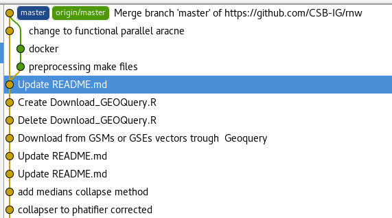
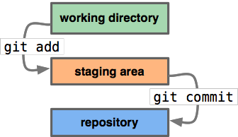
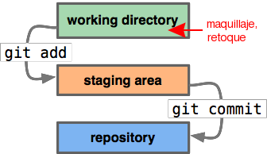
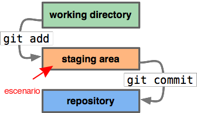

% Uso básico de git 
% Joshua Haase
% 2016-08-17 - Laboratorio de Investigación y Desarrollo de Software Libre (LIDSOL)

¿Por qué necesitamos un control de versiones? \

---

Git toma fotos de tu trabajo (cada nodo es una foto)

---

El estudio fotográfico \
\

---

El estudio fotográfico \
\

----

El estudio fotográfico \
\

---

Puedes regresar a versiones anteriores de tu trabajo

---

---

---

# Saber más

https://www.atlassian.com/git/tutorials/learn-git-with-bitbucket-cloud/create-the-repository
http://sixrevisions.com/resources/git-tutorials-beginners/